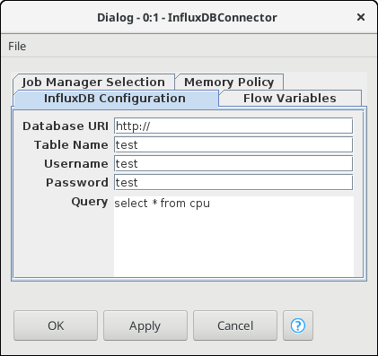

# InfluxDB Connector

Currently its not possible to load InfluxDB TimeSeries data directly into
KNIME. There are workarounds for example it is possible to execute R scripts
and therefore we can use InfluxDB in KNIME. Another way would be to use
InfluxDB REST Api to load data into KNIME (unfortunatly its a mess to deal
with that data because its super encapsulated into arrays of arrays).

## Enter the void

As KNIME is written in eclipse RCP and they provide the ability to extend
the application with additional nodes i wrote an InfluxDB Node to connect to
our InfluxDB Database and get correct DataTables for further processing.

## Installation

To use this Plugin you have to download the [released plugin](https://github.com/SecLab-Regensburg/InfluxDBConnector/releases) (a single .jar file)
 and drop it into the `dropins` directory in your KNIME installation directory.

Then restart KNIME and there should be a new node in the node repository.

